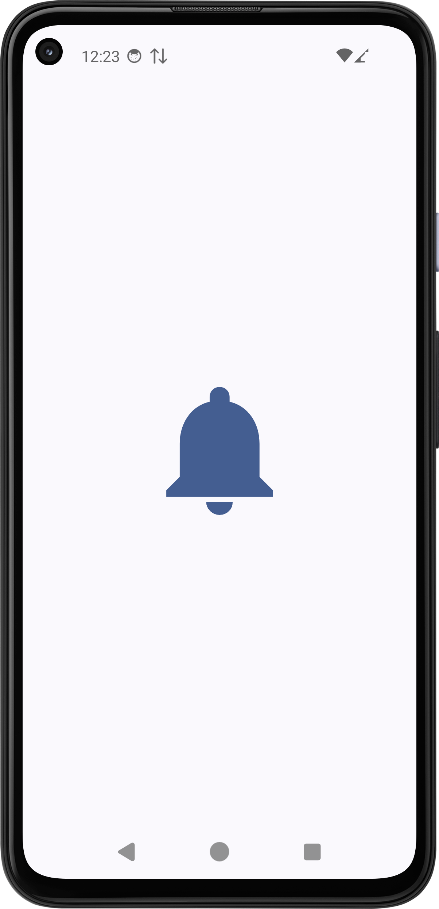
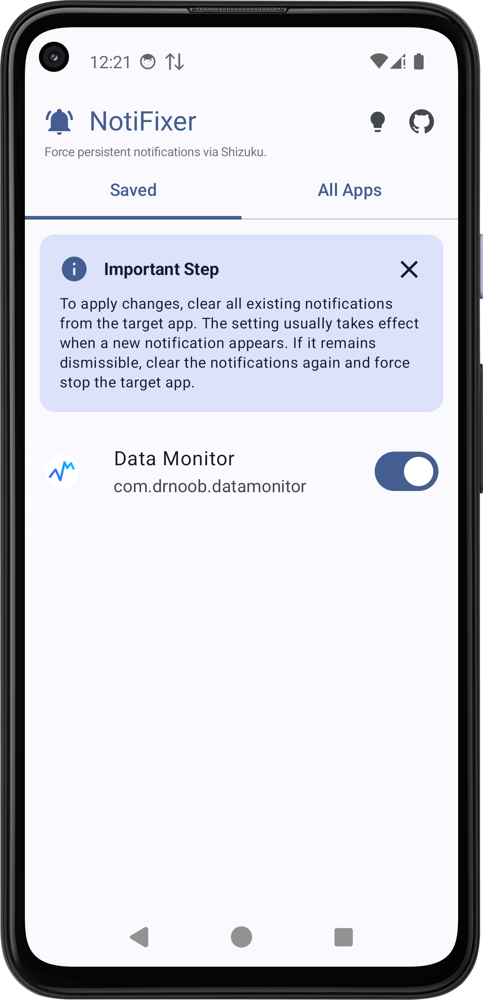
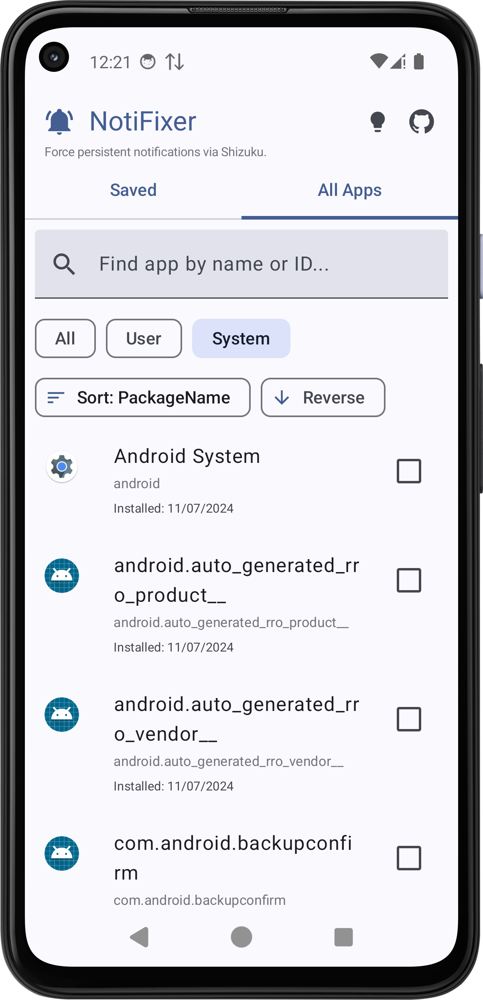

#  NotiFixer

NotiFixer is an Android utility designed to restore persistent notifications. The project was created as a solution for recent Android versions (specifically tested on **Samsung Galaxy S25 / Android 16**) where the system natively prevents apps from keeping their notifications pinned. This tool bypasses these limitations by modifying system flags.

## Table of Contents
- [Features and Usage](#features-and-usage)
- [Instructions](#instructions)
- [Technical Specifications](#technical-specifications)
- [Screenshots](#screenshots)
- [Installation & Support](#installation--support)
- [License](#license)

## Features and Usage
* **Restore Persistence Notifications:** Toggle any app's notification status to make it undismissable.
* **Interface:** Built using Jetpack Compose and Material 3.
* **Search & Sort:** Quickly find apps by name or package ID and sort them by install date, update time, or name.

## Instructions
1. Ensure the **[Shizuku](https://shizuku.rikka.app/)** service is running on your device.
2. Open **NotiFixer** and grant it Shizuku permissions.
3. Select an app from the list to enable or disable persistent notifications.

## Technical Specifications

| Category | Details |
| :--- | :--- |
| **Requirements** | Android 12.0+ (Optimized for **Android 16**) |
| **Service** | Active **Shizuku** instance (Wireless Debugging, ADB, or Root) |
| **Stack** | Jetpack Compose, Lottie, AndroidX SplashScreen |

### Under the Hood
The application uses Shizuku to execute the following `appops` commands:
* **Enable:** `appops set <pkg> SYSTEM_EXEMPT_FROM_DISMISSIBLE_NOTIFICATIONS allow`
* **Disable:** `appops set <pkg> SYSTEM_EXEMPT_FROM_DISMISSIBLE_NOTIFICATIONS default`

## Screenshots

  
  
  

## Installation & Support
Latest builds are available in the **[Releases](../../releases)** section.

* **Issues:** If you encounter bugs or have feature requests, please **[open an issue](../../issues)**.
* **Disclaimer:** This project is not affiliated with the Shizuku project. The developer is not responsible for any system instability, damages, or other consequences resulting from the use of this application. Use at your own risk.

## License
This project is licensed under the **MIT License**. You are free to use, modify, and distribute the code, provided that the original copyright notice is preserved. See the **[LICENSE](./LICENSE)** file for full details.

